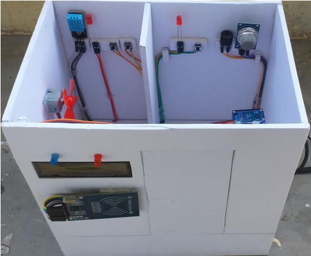

# <h1> Welcome to my Smart Home </h1>

## Yêu cầu phần cứng
> [!NOTE]
> MCU: ESP32
> 
> Sensor: DHT11, MQ4
> 
> Module: RFID, Buzzer, LCD, LN98N
> 
> Motor: Servo, Motor 5V

## Yêu cầu phần mềm
> [!NOTE]
> Arduino IDE, MIT App Inverter

## Mô hình tổng quan hệ thống

## Mô hình thực tế

## Giao diện ứng dụng điều khiển
